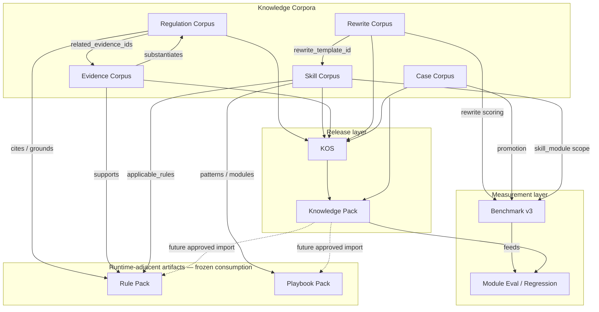

# AAIRP Knowledge Roadmap v1.0

**Document ID:** KNOWLEDGE-ROADMAP-v1.0  
**Status:** Approved — master planning document  
**Effective:** 2026-06-30  
**Supersedes:** informal roadmap sections prior to Sprint 5B-E0 freeze  

**Related:** [KNOWLEDGE-AUTHORING-STANDARD.md](./KNOWLEDGE-AUTHORING-STANDARD.md) · [SPRINT-5B-E0 — Knowledge Platform Core](../sprint-5/SPRINT-5B-E0-KNOWLEDGE-PLATFORM-CORE.md) · [ADR-004 — Executable Knowledge System](../adr/ADR-004-executable-knowledge-system.md)

---

## Executive summary

AAIRP knowledge is organized as five **Knowledge Corpora** under one **Knowledge Platform**. Each corpus is versioned, owned, governed, and released through a shared SDK — not as isolated file collections.

**Frozen foundations (do not rework without approval):**

| Milestone | State |
|-----------|--------|
| Sprint 5A — Regulation Corpus | **Complete & frozen** (75 entries, 7 APAC markets) |
| Sprint 5B-E0 — Knowledge Platform Core | **Complete & frozen** (shared SDK; regulation = first plugin) |
| Review runtime pipeline | **Frozen** (`Rule → Playbook → LLM → Decision`) |

All future knowledge work **extends the platform and adds corpus plugins**. It does not duplicate governance logic or modify runtime behavior unless explicitly approved.

---

## 1. Knowledge vision

### 1.1 What AAIRP knowledge is

AAIRP is a **knowledge-operated compliance system**. The review engine executes decisions; **knowledge** determines whether those decisions are correct, explainable, owned, measurable, and improvable.

Knowledge is the **compounding asset**:

- Every regulation indexed increases market coverage without re-engineering rules.
- Every verified case strengthens benchmark confidence.
- Every evidence artifact enables substantiation traceability.
- Every rewrite template makes eval and reviewer guidance consistent.

### 1.2 Design principles

| Principle | Meaning |
|-----------|---------|
| **Corpus-first** | Author in typed corpora with shared envelope and linkage — not ad-hoc JSON scattered across repos |
| **Platform-governed** | KQS, freshness, validation, coverage, and dashboard come from the Knowledge Platform SDK |
| **Runtime-adjacent** | Knowledge informs governance, eval, and future KOS import — it does not silently change live review behavior |
| **Linkage-native** | Every entry participates in a cross-corpus graph (`knowledge_id` + `KnowledgeLinkage`) |
| **Measure before scale** | Expand corpora only when quality gates and KPIs support the release |

### 1.3 Strategic evolution

```
Phase 1 — Foundation (Sprint 3–4)     Taxonomy, linkage, benchmark v3, health KPIs
Phase 2 — Corpus (Sprint 5)           Regulation Corpus + Knowledge Platform Core
Phase 3 — Expansion (Sprint 5B–6)     Skill, Evidence, Rewrite, Case corpus plugins
Phase 4 — Operation (Sprint 6+)       KOS authoring → Knowledge Pack → eval/runtime consumption
```

**Long-term target:** An **Executable Knowledge System (EKS)** where git corpora and KOS versions publish into a fingerprinted **Knowledge Pack** consumed by evaluation and (when approved) runtime.

---

## 2. Knowledge taxonomy

All knowledge rolls up to the **Knowledge Corpus** umbrella. Five corpus types are reserved in schema and platform:

| Corpus | `corpus_type` | Primary question it answers |
|--------|---------------|----------------------------|
| **Regulation Corpus** | `regulation` | *What law or code applies?* |
| **Skill Corpus** | `skill` | *How should we review this claim type?* |
| **Evidence Corpus** | `evidence` | *What substantiation exists or is required?* |
| **Rewrite Corpus** | `rewrite` | *How should non-compliant copy be revised?* |
| **Case Corpus** | `case` | *What is the verified ground truth for this ad?* |

### 2.1 Shared identity model

| Field | Role |
|-------|------|
| `knowledge_id` | Canonical ID: `{corpus_type}:{stable-key}` |
| `corpus_type` | One of five reserved types |
| `owner` / `owner_type` | Accountability (`legal`, `compliance`, `knowledge_eng`, `product`) |
| `last_reviewed` | Freshness input (green / yellow / red bands) |
| `review_status` | Legacy gate: `draft` · `legal_reviewed` · `deprecated` |
| `summary` | Plain-language description (all corpora) |
| `review_guidance` | Actionable reviewer guidance (all corpora) |
| `confidence_level` | `high` · `medium` · `low` (field or tag during migration) |
| `evidence_requirement` | `none` · `recommended` · `required` |
| `linkage` | Structured `KnowledgeLinkage` object |

Type-specific stable keys (e.g. `regulation_id`, `template_id`, `case_id`) remain during migration.

### 2.2 Corpus summaries (detail in §10)

| Corpus | Maturity today | Platform plugin |
|--------|----------------|-----------------|
| Regulation | **Production** (75 entries) | ✓ Registered |
| Skill | **Foundation** (5 skills / Advertising Review) | ✓ Registered |
| Evidence | **Not started** (schema reserved) | Planned 5C |
| Rewrite | **Production** (9 templates) | ✓ Registered |
| Case | **Operational** (`case-library/`) | Planned 5D |

---

## 3. Dependency graph

Knowledge corpora and downstream systems form a directed graph. **Upstream** entries justify and link to **downstream** execution and measurement artifacts.



### 3.1 Linkage chain (review semantics)

Primary vertical chain for advertising compliance review:

```
Regulation → Rule → Skill → Benchmark → Case → Evaluation
         ↘ Evidence ↗          ↘ Rewrite ↗
```

| Hop | Link mechanism | Status |
|-----|----------------|--------|
| Regulation → Rule | `linkage.rules` / `related_rule_ids` | Partial (~60% regulation entries linked) |
| Rule → Skill | `applicable_rules` on skill modules | ✓ In skill-modules.json |
| Skill → Playbook pattern | `patterns[].pattern_id` | ✓ Runtime demo |
| Pattern → Benchmark | `pattern_id`, `skill_module` on benchmark cases | ✓ benchmark-v3 |
| Benchmark → Case | Promotion lifecycle | Weak — no universal `knowledge_id` bridge yet |
| Regulation → Evidence | `linkage.evidence` / `related_evidence_ids` | Reserved (empty in 5A) |
| Skill → Rewrite | `rewrite_template_id` | ✓ In skill modules |
| Rewrite → Eval | Rewrite dimension scoring | ✓ benchmark-v3 |

### 3.2 Platform dependency

Every corpus **depends on** Knowledge Platform Core (5B-E0, frozen):

- `KnowledgeCorpusPlugin` implementation
- Shared governance: validator, KQS, freshness, coverage, dashboard
- Registration in `knowledge-platform.ts`

No new corpus may ship without a platform plugin.

---

## 4. Build order

Order reflects **dependencies**, **risk reduction**, and **existing asset maturity** — not arbitrary parallelism.

| Phase | Sprint / release | Deliverable | Rationale |
|-------|------------------|-------------|-----------|
| **0** | 5A ✓ | Regulation Corpus (75 entries) | First corpus; grounds all markets |
| **0** | 5B-E0 ✓ | Knowledge Platform Core | Shared SDK before second corpus |
| **1a** | 5B-1 | **Skill Corpus plugin** | Skill modules already exist; unlocks linkage graph center |
| **1b** | 5B-2 | **Rewrite Corpus plugin** | Small, eval-linked; migrates `rewrite-templates.json` |
| **2a** | 5B-3 | KOS import: Regulation → KOS | Operational store for legal-owned entries |
| **2b** | 5B-4 | Knowledge Pack manifest v2 (corpus fingerprints) | Optional E6; release artifact convergence |
| **3** | 5C | **Evidence Corpus plugin** (pilot 20+) | Enables `related_evidence_ids`; substantiation path |
| **4** | 5D | **Case Corpus plugin** | Largest volume; promotion queue + `knowledge_id` bridge to benchmark |
| **5** | 6+ | Unified linkage graph validator | Single report: corpus + skill + benchmark |
| **6** | 6+ | KOS → Pack automated export | ADR-004 target model |
| **7** | 7+ | Runtime consumption (if approved) | Pack-driven rule/playbook — **not default** |

**Rule:** Do not start Evidence Corpus until Skill + Rewrite plugins prove the platform at scale. Do not start Case Corpus formalization until Evidence pilot defines substantiation linkage patterns.

---

## 5. Ownership

### 5.1 Owner types

| `owner_type` | Accountable for | Example owner |
|--------------|-----------------|---------------|
| `legal` | Regulation entries, legal-reviewed cases, high-risk skill escalation | `legal-apac@aairp` |
| `compliance` | Industry codes, disclosure norms, cross-market policy | `compliance-apac@aairp` |
| `knowledge_eng` | Skill modules, benchmark promotion, platform health, case pipeline | `knowledge-eng@aairp` |
| `product` | Pilot metrics, reviewer UX copy, non-legal templates | `product@aairp` |

### 5.2 Corpus ownership matrix

| Corpus | Primary owner | Review authority | Update trigger |
|--------|---------------|------------------|----------------|
| Regulation | Legal APAC | Legal counsel | Statutory change, new market, rule linkage gap |
| Skill | Knowledge Eng + Legal | Legal for claim-class modules; KE for patterns | New claim type, playbook change, eval regression |
| Evidence | Compliance + Legal | Legal for binding substantiation | New certification type, lab method change |
| Rewrite | Knowledge Eng | Legal spot-check for claim-class templates | Benchmark rewrite failures, new pattern |
| Case | Knowledge Eng | Legal for regression-tier cases | Pilot uploads, FP/FN analysis, promotion |

### 5.3 Ownership SLA (governance, not runtime)

| Freshness band | `last_reviewed` age | Action |
|----------------|---------------------|--------|
| **Green** | < 180 days | None required |
| **Yellow** | 180–365 days | Schedule review |
| **Red** | > 365 days | Mandatory review before next Knowledge Pack release |

Deprecated entries (`review_status: deprecated` / lifecycle `retired`) remain in git for audit but are excluded from coverage numerators and regression linkage.

---

## 6. Release strategy

### 6.1 Release units

| Unit | Role | Consumer |
|------|------|----------|
| **Corpus git commit** | Authoring source of truth | Platform validators, CI |
| **Corpus manifest** | `{corpus}-corpus.manifest.json` — fingerprint, counts, KQS | Knowledge Pack, dashboards |
| **KOS publish** | Versioned operational object | Admin UI, search, audit |
| **Knowledge Pack** | Immutable release bundle with composite fingerprint | Eval, future runtime |
| **Benchmark baseline** | Frozen regression tier snapshot | CI gates, module dashboard |

### 6.2 Release cadence (target)

| Artifact | Cadence | Gate |
|----------|---------|------|
| Corpus content (legal) | Quarterly per market + ad-hoc on regulatory change | Legal review + validator pass |
| Corpus content (KE) | Bi-weekly during active sprint | Platform validator + KQS floor |
| Knowledge Pack | Monthly (target) | All registered corpus manifests + linkage report |
| Benchmark regression tier | Quarterly expansion | 100% legal verification on tier |
| Platform SDK | Per sprint epic | Tests + no breaking change without major version |

### 6.3 Release flow (target state)

```
Author (git corpus) → Platform validate → Corpus manifest build
        → KOS import/publish (optional per corpus)
        → Knowledge Pack assemble (fingerprints + ownership snapshot)
        → Eval run (benchmark v3) → Health + platform dashboard
        → Release tag (kp-YYYY.MM.patch)
```

**Current state:** Regulation Corpus and platform dashboards are operational. Knowledge Pack includes demo component counts; full corpus fingerprint convergence is **5B-4** (E6 deferred).

### 6.4 What releases do *not* do (standing)

- Knowledge Pack releases **do not** automatically change runtime rule/playbook behavior.
- Governance warnings **do not** block runtime — they block **release promotion** when gates are hardened (T2+).

---

## 7. Version strategy

### 7.1 Identifier layers

| Layer | Format | Example |
|-------|--------|---------|
| **Knowledge entry** | `knowledge_id` | `regulation:sg-hpa-s7-prohibited-claims` |
| **Corpus manifest** | `{corpus}-corpus.manifest.json` + `fingerprint` (16-char SHA) | `64490f801dadc376` |
| **Platform** | `KNOWLEDGE_PLATFORM_VERSION` | `1.0.0` (5B-E0 frozen) |
| **Knowledge Pack** | `knowledge_pack_version` | `kp-2026.07.1` |
| **Benchmark** | `benchmark_id` + tier | `benchmark-v3` / regression baseline |
| **KOS object** | `{object_key}-v{n}` | `demo-sg-health-forbidden-claim-v1` |

### 7.2 Versioning rules

| Change type | Version bump | Example |
|-------------|--------------|---------|
| New corpus entry (additive) | Corpus manifest fingerprint changes | +1 regulation JSON |
| Entry content edit | Fingerprint + `last_reviewed` update | Citation fix |
| Deprecated entry | Fingerprint; entry retained | `review_status: deprecated` |
| Platform SDK breaking plugin contract | `KNOWLEDGE_PLATFORM_VERSION` major | New required plugin method |
| Platform SDK additive | minor | New shared KQS dimension helper |
| Knowledge Pack | Monthly patch increment | `kp-2026.07.2` |
| Regression baseline | New frozen snapshot on tier change | New baseline ID + ADR note |

### 7.3 Immutability

- **Published** Knowledge Pack versions are immutable; fixes require a new pack version.
- **Regression baseline** is frozen until explicit recalibration (Sprint 4A precedent).
- Git history is the audit trail for all corpus entries.

### 7.4 Schema evolution

1. Add optional fields to shared envelope → platform minor bump.
2. Add corpus-specific schema via `allOf` envelope pattern (regulation precedent).
3. Promote tags to fields (`confidence_level`, `evidence_requirement`) → corpus schema minor, migration script.
4. Breaking ID or linkage format → major platform version + migration guide.

---

## 8. Quality gates

Gates apply to **knowledge releases and CI** — not to live review API requests.

### 8.1 Gate tiers

| Tier | Name | Scope | Blocks release today | Target |
|------|------|-------|----------------------|--------|
| **T0** | Schema + platform validator | Per corpus; 0 errors | No (warnings only) | Yes for pack publish |
| **T1** | Linkage validator | Skill ↔ pattern ↔ rule ↔ benchmark | Warn | Error on strict tier |
| **T2** | Module eval / regression compare | Regression tier vs baseline | Report-only | Block pack if regression fail |
| **T3** | Legal verification + KQS floor | 100% legal on regression; KQS ≥ threshold | No | Block merge / pack |

### 8.2 Platform governance checks (all corpora)

Every corpus plugin must pass:

| Check | Severity | Notes |
|-------|----------|-------|
| Duplicate `knowledge_id` | Error | |
| Invalid linkage targets | Error | e.g. unknown rule IDs for regulation |
| Missing confidence / evidence classification | Warning | Promote to error at T0 hardening |
| Stale knowledge (> 365 days) | Warning | Red freshness band |
| Orphan linkage (no outbound links) | Warning | Policy per corpus |
| KQS below corpus floor | Warning → Error | Floor defined per release |

### 8.3 Corpus-specific gates

| Corpus | Additional gate |
|--------|-----------------|
| Regulation | Country/category coverage report; no duplicate citations (warn) |
| Skill | Every playbook pattern mapped; every pattern has benchmark (strict) |
| Evidence | Document ref locatable; expiry date where applicable |
| Rewrite | Every template referenced by ≥1 skill pattern or benchmark rewrite case |
| Case | Regression-tier cases must be `legal_reviewed` |

### 8.4 Release promotion checklist

Before tagging a Knowledge Pack release:

- [ ] All registered corpus plugins: validator **0 errors**
- [ ] Platform dashboard: KQS ≥ release floor (see §9)
- [ ] Linkage report: 0 errors at configured tier
- [ ] Regression tier: weighted quality ≥ 95% (when T3 active)
- [ ] Manifest fingerprints recorded in pack metadata
- [ ] No runtime pipeline diff unless explicitly approved

---

## 9. KPIs

KPIs are **organizational metrics** reported via platform and health dashboards — not runtime SLAs.

### 9.1 Primary KPIs

| KPI | Definition | Current (2026-06-30) | 6-mo (2026-12) | 12-mo (2027-06) |
|-----|------------|----------------------:|---------------:|----------------:|
| **Regulation entries** | Regulation Corpus count | 75 | 80–100 | 150+ |
| **Regulation KQS** | Platform KQS mean | 92.2% | ≥ 90% | ≥ 92% |
| **Skill modules** | Skill Corpus entries (patterns mapped) | 8 modules / 13 patterns | 10 / 15 | 12 / 20 |
| **Evidence entries** | Evidence Corpus count | 0 | 20+ | 50+ |
| **Rewrite templates** | Rewrite Corpus count | 9 | 15+ | 25+ |
| **Case library** | Case Corpus records | 144 | 200+ | 500+ |
| **Case verification rate** | % cases human-verified | TBD | 50% | 70% |
| **Benchmark cases** | benchmark-v3 total | 92 | 110 | 150+ |
| **Regression tier size** | Frozen regression cases | 9 | 15+ | 20+ |
| **Regression weighted quality** | benchmark v3 regression tier | 97.8% | ≥ 95% stable | ≥ 95% |
| **Legal verification (regression)** | % regression cases legal-reviewed | 88.9% | 100% | 100% |
| **Linkage health** | Linkage validator errors | 0 | 0 | 0 |
| **Platform corpora registered** | Plugins in platform registry | 1 | 3+ | 5 |
| **Knowledge Pack cadence** | Releases per quarter | Ad-hoc | 3+ | Monthly steady |

### 9.2 KPI sources (reporting commands)

```bash
pnpm knowledge:platform-dashboard
pnpm knowledge:health-report
pnpm knowledge:validate-linkage
pnpm knowledge:validate-regulation-corpus
pnpm eval:module-dashboard -- --tier=regression
pnpm knowledge:pack-manifest
```

### 9.3 KPI principles

1. **Coverage ≠ quality** — high entry count with low KQS is a failed release.
2. **Measure before expanding** — regression baseline frozen before T3 enforcement.
3. **Legal verification is non-optional** for regression-tier cases and regulation entries marked `legal_reviewed`.
4. **Pilot accuracy** — benchmark proxy today; live pilot dashboard is a Phase 4 KPI.

---

## 10. Target scale

Per-corpus planning parameters for APAC-first expansion (7 markets: SG, MY, TH, ID, JP, KR, AU).

---

### 10.1 Regulation Corpus

| Dimension | Definition |
|-----------|------------|
| **Purpose** | Authoritative advertising and product-claim regulations by market and claim category; grounds rules and reviewer context |
| **Data model** | `KnowledgeEntry` + `regulation_id`, `country`, `authority`, `citation`, `category` (12 claim types), `risk_level`, `linkage.rules`, `linkage.evidence` |
| **Governance** | Platform plugin ✓ · KQS (7 dimensions) · Country/category coverage · Legal ownership |
| **Expected volume** | **75 now** → 100 (6-mo) → 150+ (12-mo) |
| **Source** | Legal authoring in `docs/knowledge/regulation-corpus/`; official statutes and codes (Tier 1–3 per Authoring Standard) |
| **Update frequency** | Quarterly review; ad-hoc on regulatory change |
| **Relationships** | → Rules (`linkage.rules`) · → Evidence (`linkage.evidence`) · ← Skill (interpretation context) · → Benchmark (indirect via rules) |

---

### 10.2 Skill Corpus

| Dimension | Definition |
|-----------|------------|
| **Purpose** | Operational contracts for review capabilities: modules, playbook patterns, activation scope, escalation, golden-issue mapping |
| **Data model** | `KnowledgeEntry` + `skill_module`, `activation_conditions` (countries, categories, modalities), `patterns[]`, `applicable_rules`, `escalation_policy`, `linkage.rules`, `linkage.rewrites`, `linkage.benchmarks` |
| **Governance** | Platform plugin (planned) · Pattern↔benchmark linkage gate · KE + Legal co-ownership |
| **Expected volume** | **8 modules / 13 patterns now** → 10 / 15 (6-mo) → 12 / 20 (12-mo) |
| **Source** | Migration from `skill-modules.json` + `demo/playbook.demo.md` metadata; future KOS export |
| **Update frequency** | Per sprint when patterns change; quarterly legal review for claim-class modules |
| **Relationships** | → Rules · → Rewrite templates · → Benchmark cases (skill_module) · ← Regulation (context) · ← Case (FP/FN feedback) |

---

### 10.3 Evidence Corpus

| Dimension | Definition |
|-----------|------------|
| **Purpose** | First-class substantiation knowledge: lab reports, certifications, test methods, validity windows |
| **Data model** | `KnowledgeEntry` + `document_ref`, `issuer`, `evidence_type`, `valid_from` / `valid_to`, `applicable_claim_types`, `linkage.regulations`, `linkage.rules` |
| **Governance** | Platform plugin · Expiry freshness · Legal/compliance review for binding evidence |
| **Expected volume** | **0 now** → 20+ pilot (6-mo) → 50+ (12-mo) |
| **Source** | Certification bodies, lab report metadata (not raw PII blobs in git); compliance uploads |
| **Update frequency** | Ad-hoc on new product evidence; annual cert renewal review |
| **Relationships** | ← Regulation (required/forbidden claims) · → Rules (substantiation) · ← Case (evidence attachments) · → Eval (evidence dimension, future) |

---

### 10.4 Rewrite Corpus

| Dimension | Definition |
|-----------|------------|
| **Purpose** | Consistent, measurable rewrite guidance: strategies, must-remove terms, must-include concepts |
| **Data model** | `KnowledgeEntry` + `template_id`, `strategy`, `must_remove_terms`, `must_include_concepts`, `linkage.skills`, `linkage.benchmarks` |
| **Governance** | Platform plugin · Benchmark rewrite dimension alignment · KE ownership |
| **Expected volume** | **9 now** → 15+ (6-mo) → 25+ with locale variants (12-mo) |
| **Source** | Migration from `rewrite-templates.json`; derived from skill pattern `rewrite_template_id` |
| **Update frequency** | Per benchmark calibration cycle; ad-hoc on rewrite eval failures |
| **Relationships** | ← Skill patterns · → Benchmark v3 rewrite scoring · ← Case (rewrite examples) |

---

### 10.5 Case Corpus

| Dimension | Definition |
|-----------|------------|
| **Purpose** | Verified review cases: ad fixtures, ground truth, lifecycle, promotion to benchmark |
| **Data model** | `KnowledgeEntry` + `case_id`, `lifecycle_stage`, `dimensions` (country, category, platform), `ground_truth`, `linkage.rules`, `linkage.skills`, `linkage.regulations`, `linkage.benchmarks` |
| **Governance** | Platform plugin · Promotion queue · Legal review for regression promotion · Verification rate KPI |
| **Expected volume** | **144 now** → 200+ / 50% verified (6-mo) → 500+ / 70% verified (12-mo) |
| **Source** | Pilot uploads, RC campaigns, manual legal review, auto-save pipeline |
| **Update frequency** | Continuous ingestion; weekly promotion triage |
| **Relationships** | → Benchmark (promotion) · ← Skill (module attribution) · ← Regulation (citation context) · → Eval (ground truth) |

---

## 11. Sprint alignment (reference)

| Sprint | Knowledge focus | Status |
|--------|-----------------|--------|
| 5A | Regulation Corpus | **Frozen** |
| 5B-E0 | Knowledge Platform Core | **Frozen** |
| 5B-1 | Skill Corpus plugin | Planned |
| 5B-2 | Rewrite Corpus plugin | Planned |
| 5B-3 | KOS regulation import | Planned |
| 5B-4 | Knowledge Pack corpus fingerprints (E6) | Planned |
| 5C | Evidence Corpus pilot | Planned |
| 5D | Case Corpus plugin | Planned |
| 6+ | Unified linkage · T3 gates · KOS pack export | Planned |

---

## 12. Document map

| Document | Role |
|----------|------|
| **KNOWLEDGE-ROADMAP-v1.0.md** (this file) | Master planning document |
| [KNOWLEDGE-ROADMAP.md](./KNOWLEDGE-ROADMAP.md) | Pointer + revision log |
| [KNOWLEDGE-AUTHORING-STANDARD.md](./KNOWLEDGE-AUTHORING-STANDARD.md) | Authoring rules (all corpora) |
| [REGULATION-CORPUS.md](./REGULATION-CORPUS.md) | Regulation authoring guide |
| [SPRINT-5B-E0-KNOWLEDGE-PLATFORM-CORE.md](../sprint-5/SPRINT-5B-E0-KNOWLEDGE-PLATFORM-CORE.md) | Platform SDK (frozen) |
| [ADR-004](../adr/ADR-004-executable-knowledge-system.md) | Executable Knowledge System vision |

---

## Revision history

| Version | Date | Change |
|---------|------|--------|
| **1.0** | 2026-06-30 | Initial approved master roadmap post 5A + 5B-E0 freeze; five corpus taxonomy; dependency graph; build order; ownership; release/version strategy; quality gates; KPIs; target scale |

---

**Approval:** Knowledge Architecture Review approved · Sprint 5A frozen · Sprint 5B-E0 frozen  
**Next planning action:** Sprint 5B-1 — Skill Corpus plugin (no runtime changes)
