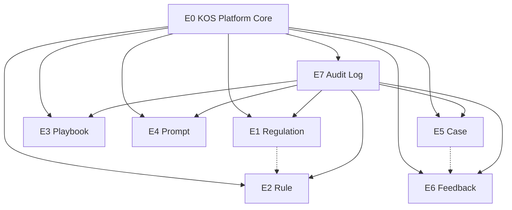

# Sprint 2A — Knowledge Operating System (KOS) Roadmap

**Sprint ID:** 2A  
**Theme:** 建设广告审核系统的 **Knowledge Operating System（KOS）** — 不是「后台 CRUD 开发」  
**Status:** In Progress (repositioned 2026-06-26)  
**Version:** 2.0.0

---

## 1. What is KOS?

**KOS** 是审核知识的 **唯一运营层**：所有可被审核链路 **读取** 的知识对象，都在 KOS 中完成 **全生命周期管理**。

```
┌─────────────────────────────────────────────────────────────────┐
│              Knowledge Operating System (KOS)                    │
│  查询 · 编辑 · 版本 · 发布 · 回滚 · 搜索 · 审计                    │
├─────────────────────────────────────────────────────────────────┤
│ Regulation │ Rule │ Playbook │ Prompt │ Case │ Feedback │ Audit  │
└─────────────────────────────────────────────────────────────────┘
         ▲ read-only at runtime (Sprint 2A)
         │ no write path into Decision Engine
┌────────┴────────────────────────────────────────────────────────┐
│ Sprint 1 Happy Path (FROZEN)                                     │
│ Upload → Context → Rule* → Playbook* → LLM* → Decision → Report │
│ * still demo-hardcoded until Sprint 2B Runtime Gateway           │
└─────────────────────────────────────────────────────────────────┘
```

### KOS 管理的 7 类对象

| # | Object | 说明 | Sprint 1 现状 |
|---|--------|------|---------------|
| 1 | **Regulation** | 法规/条例/政策引用（法名、条款、司法辖区） | 仅 Rule citation 片段 |
| 2 | **Rule** | 可执行规则定义（scope、severity、pattern payload） | 硬编码 + `demo/rules.demo.json` |
| 3 | **Playbook** | 模式/指引（terms、guidance、markdown） | 硬编码 + `demo/playbook.demo.md` |
| 4 | **Prompt** | LLM 模板（open_risk 等） | 文件 `demo/open-risk.prompt.txt` |
| 5 | **Case** | 审核判例快照（20 字段 Case Schema） | JSON `case-library/` Auto Save ✅ |
| 6 | **Feedback** | 人工反馈/ Pilot 标注 | 模板 + CSV，无 KOS API |
| 7 | **Audit Log** | 全对象变更审计 | 表设计已起草，未接线 |

### 每类对象统一的 7 项能力

| 能力 | 含义 |
|------|------|
| **查询** | Get by ID / list / filter by dimensions |
| **编辑** | Create / update **DRAFT** 版本 |
| **版本管理** | 多版本；仅一个 `PUBLISHED`（可配置） |
| **发布** | DRAFT → PUBLISHED；旧 PUBLISHED → ARCHIVED |
| **回滚** | 将历史 PUBLISHED/ARCHIVED 版本 re-publish 为新 PUBLISHED |
| **搜索** | 维度过滤 + 全文/关键词（Phase 1 PG；Phase 2 向量仅索引） |
| **审计** | 每次写操作 → `audit.audit_event` |

---

## 2. Hard constraints（Must NOT）

| ID | 禁止项 | 验证 |
|----|--------|------|
| C1 | 新增审核能力（新 Rule 命中逻辑、新 Decision 路径） | `RuleEngine` / `DecisionEngine` 无业务逻辑 diff |
| C2 | 修改 Happy Path 行为 | `pnpm eval:benchmark --regression` 绿 |
| C3 | 修改 Decision Engine 融合逻辑 | `decision-engine.service.ts` 无改动 |
| C4 | Learning / 自动从 Feedback 调规则 | 无 training pipeline |
| C5 | Agent / 自主审核 Agent | 无 agent orchestration |
| C6 | KOS 写入路径进入运行时 Decision | KOS API 与 `/demo/review` 隔离；Runtime Gateway = Sprint 2B |

---

## 3. Priority-ordered Epic overview

| Priority | Epic | 名称 | 依赖 |
|----------|------|------|------|
| **P0** | E0 | KOS Platform Core | — |
| **P1** | E1 | Regulation | E0 |
| **P2** | E2 | Rule | E0, E1 (soft) |
| **P3** | E3 | Playbook | E0 |
| **P4** | E4 | Prompt | E0 |
| **P5** | E5 | Case | E0 |
| **P6** | E6 | Feedback | E0, E5 (soft) |
| **P7** | E7 | Audit Log (operational) | E0；横切 E1–E6 |

**已开工资产（纳入 E0/E2/E5，不重复造轮子）：**

- `V2.0.0__*.sql` migrations（draft）
- PG repositories skeleton（Rule / Playbook / Prompt / Review / Feedback / Audit）
- Case Auto Save JSON + `/admin/cases*`
- `RuleAdminService` + `AuditLogService`（partial）

---

## 4. Epic breakdown

---

### E0 — KOS Platform Core `[P0]`

**Objective:** 所有知识对象共享的版本模型、API 约定、搜索与审计 spine。

| Story | Summary |
|-------|---------|
| E0-S1 | KOS domain model & version lifecycle |
| E0-S2 | Database schema & migration runner |
| E0-S3 | KOS API gateway (`/kos/v1/*`) |
| E0-S4 | Universal search & pagination |
| E0-S5 | Publish / rollback engine |
| E0-S6 | Demo knowledge import CLI |

#### E0-S1 — KOS domain model & version lifecycle

| Task | Dependency |
|------|------------|
| T1.1 定义 `KnowledgeObjectType` enum（7 类） | — |
| T1.2 统一 `PackVersionStatus` + `publish()` / `rollback()` 状态机 | — |
| T1.3 `shared-kernel/kos/*` 通用类型（`VersionedEntity`, `PublishResult`, `RollbackResult`） | T1.1 |
| T1.4 文档：`docs/sprint-2a/kos-version-lifecycle.md` | T1.2 |

**DoD:**

- [ ] 状态机单测：非法 DRAFT→ARCHIVED 拒绝；每对象仅 1 PUBLISHED
- [ ] 7 类对象映射表文档化
- [ ] 不触碰 `ReviewPipelineService`

#### E0-S2 — Database schema & migration runner

| Task | Dependency |
|------|------------|
| T2.1 完善 `V2.0.0__knowledge_tables.sql`（含 **regulation** 表） | T1.1 |
| T2.2 `V2.0.0__audit_events.sql` + grants | T2.1 |
| T2.3 本地 migrate 脚本 `scripts/migrate.ps1` | T2.2 |
| T2.4 CI：Postgres service + migrate smoke | T2.3 |

**DoD:**

- [ ] Fresh DB + upgrade from V1 成功
- [ ] Rollback note in `migrations/README.md`
- [ ] `/ready` 仍正常

#### E0-S3 — KOS API gateway

| Task | Dependency |
|------|------------|
| T3.1 Fastify plugin `registerKosRoutes` — prefix `/kos/v1` | T1.3 |
| T3.2 Problem+JSON + 统一 pagination (`limit`, `offset`, `q`) | T3.1 |
| T3.3 `GET /kos/v1/health` | T3.1 |
| T3.4 与 `/demo/*`、`/admin/cases*` 路由隔离文档 | T3.1 |

**DoD:**

- [ ] `/kos/v1/health` → 200
- [ ] Demo 路由测试无回归
- [ ] OpenAPI / `docs/sprint-2a/kos-api.md` 骨架

#### E0-S4 — Universal search

| Task | Dependency |
|------|------------|
| T4.1 `KosSearchService` — 跨对象 keyword + facet | T2.1 |
| T4.2 PG `tsvector` 或 `ILIKE` 索引策略 | T2.1 |
| T4.3 `GET /kos/v1/search?type=rule&q=cure&country_id=SG` | T4.1, T3.1 |

**DoD:**

- [ ] 至少 Rule + Case 可被统一搜索 endpoint 命中
- [ ] 搜索只读，不写 audit（读操作可选 access log Sprint 2B）

#### E0-S5 — Publish / rollback engine

| Task | Dependency |
|------|------------|
| T5.1 `KosPublishService.publish(objectType, versionId)` | T1.2, T2.1 |
| T5.2 `KosPublishService.rollback(objectType, versionId)` — 再发布指定历史版本 | T5.1 |
| T5.3 同事务：archive 旧 PUBLISHED + audit 记录 | E7-S1 |

**DoD:**

- [ ] Rule 版本 publish + rollback 集成测试（PG）
- [ ] Rollback 产生新 PUBLISHED，旧版 ARCHIVED，audit 有 `ROLLBACK` action

#### E0-S6 — Demo knowledge import

| Task | Dependency |
|------|------------|
| T6.1 `pnpm kos:import-demo` — rules / playbook / prompt → KOS DRAFT→PUBLISHED | E2, E3, E4 基础 CRUD |
| T6.2 幂等；不修改运行时 demo 文件 | T6.1 |

**DoD:**

- [ ] Import 后 KOS 中可查到与 demo 文件等价的 PUBLISHED 版本
- [ ] Happy Path 仍读硬编码，行为不变

**Epic E0 DoD:** Platform 可支撑任意知识对象 CRUD+版本+publish+rollback+search+audit 的 **插件式** 接入。

---

### E1 — Regulation `[P1]`

**Objective:** 法规引用作为 **一等知识对象**，供 Rule / Case / Report 引用。

| Story | Summary |
|-------|---------|
| E1-S1 | Regulation entity & storage |
| E1-S2 | Regulation CRUD & version API |
| E1-S3 | Regulation search & link to Rule |

#### E1-S1 — Regulation entity & storage

| Task | Dependency |
|------|------------|
| T1.1 表：`regulation`, `regulation_version`（jurisdiction, law_name, article, url, body_text） | E0-S2 |
| T1.2 `IRegulationRepository` + PG impl | T1.1 |
| T1.3 从现有 Rule citation 反向 seed 3 条 SG demo regulation | E0-S6 |

**DoD:**

- [ ] Regulation 支持 7 项 KOS 能力中的 storage + version 层
- [ ] 与 Rule `reference_regulations` 字段 schema 对齐

#### E1-S2 — Regulation CRUD & version API

| Task | Dependency |
|------|------------|
| T2.1 `GET/POST /kos/v1/regulations` | E0-S3, E1-S1 |
| T2.2 `POST .../versions`, `POST .../publish`, `POST .../rollback` | E0-S5 |
| T2.3 编辑仅 DRAFT；PUBLISHED 只读 | T1.2 |

**DoD:**

- [ ] API 完整走 publish/rollback
- [ ] 每次写 → audit event

#### E1-S3 — Regulation search & Rule link

| Task | Dependency |
|------|------------|
| T3.1 `regulation_version.rule_refs_json` 或 M:N link 表 | E2-S1 |
| T3.2 Search by jurisdiction + law_name | E0-S4 |
| T3.3 Export regulation bundle JSON | E0-S3 |

**DoD:**

- [ ] Rule 版本可关联 ≥1 regulation_version_id
- [ ] `GET /kos/v1/search?type=regulation&q=Health+Products`

**Epic E1 DoD:** Regulation 作为 KOS 独立对象可运营；Rule 可引用；**不进入 RuleEngine**。

---

### E2 — Rule `[P2]`

**Objective:** Rule 全生命周期 KOS 化（当前已有 partial PG repo）。

| Story | Summary |
|-------|---------|
| E2-S1 | Rule pack / definition / version (complete) |
| E2-S2 | Rule KOS API |
| E2-S3 | Rule search, export, regulation links |

#### E2-S1 — Rule storage (complete)

| Task | Dependency |
|------|------------|
| T1.1 完成 `PgRuleRepository` + rollback | E0-S5, E0-S2 |
| T1.2 `scope_json` GIN 索引查询 | E0-S2 |
| T1.3 Payload schema 对齐 `demo/rules.demo.json` | — |

**DoD:**

- [ ] publish/rollback 单测绿
- [ ] 7 项能力在 repository 层齐备

#### E2-S2 — Rule KOS API

| Task | Dependency |
|------|------------|
| T2.1 `GET/POST /kos/v1/rule-packs`, `/rules`, `/rules/:id/versions` | E0-S3, E2-S1 |
| T2.2 `POST .../publish`, `POST .../rollback` | E0-S5 |
| T2.3 迁移 `RuleAdminService` → `RuleKosService` | E2-S1 |

**DoD:**

- [ ] Postman/curl 可完成 create draft → publish → rollback
- [ ] Audit 记录 CREATE / PUBLISH / ROLLBACK

#### E2-S3 — Rule search & export

| Task | Dependency |
|------|------------|
| T3.1 Filter: country, category, status, severity | E0-S4 |
| T3.2 Export pack JSON（round-trip import） | E2-S2 |
| T3.3 Link regulation_version_ids on publish | E1-S3 |

**DoD:**

- [ ] 统一 search 可搜 rule summary / rule_key
- [ ] Export/import round-trip 无损

**Epic E2 DoD:** Rule 完全 KOS 运营；**RuleEngine 仍 hardcoded**。

---

### E3 — Playbook `[P3]`

| Story | Summary |
|-------|---------|
| E3-S1 | Playbook pack / version / pattern storage |
| E3-S2 | Playbook KOS API + publish/rollback |
| E3-S3 | Playbook markdown export |

| Task | Dependency |
|------|------------|
| 完成 `PgPlaybookRepository` rollback | E0-S5 |
| `/kos/v1/playbook-packs/*` API | E0-S3, E3-S1 |
| Import `demo/playbook.demo.md` | E0-S6 |

**DoD:**

- [ ] 3 demo patterns 在 KOS 可编辑、发布、回滚
- [ ] `PlaybookEngineService` 无改动

---

### E4 — Prompt `[P4]`

| Story | Summary |
|-------|---------|
| E4-S1 | Prompt pack / template / version storage |
| E4-S2 | Prompt KOS API + publish/rollback |
| E4-S3 | Prompt diff metadata & lint |

| Task | Dependency |
|------|------------|
| 完成 `PgPromptRepository` rollback | E0-S5 |
| `/kos/v1/prompt-templates/*` API | E0-S3, E4-S1 |
| Content size / empty lint | E4-S2 |

**DoD:**

- [ ] open-risk prompt 在 KOS 版本化
- [ ] `OpenRiskDiscoveryService` 仍读文件/stub

---

### E5 — Case `[P5]`

**Objective:** 将 JSON Case Library **纳入 KOS 统一管理**（与 Auto Save 共存迁移）。

| Story | Summary |
|-------|---------|
| E5-S1 | Case KOS schema（对齐 Case Schema 1.0） |
| E5-S2 | Case KOS API（query/search/export） |
| E5-S3 | JSON → KOS 迁移 & dual-write |
| E5-S4 | Case lifecycle（CONFIRMED / ARCHIVED / rollback label） |

#### E5-S1 — Case storage

| Task | Dependency |
|------|------------|
| T1.1 表：`case_record` + JSONB payload（完整 Case Schema） | E0-S2 |
| T1.2 `ICaseKosRepository` — 与 `JsonCaseStore` adapter 并存 | T1.1 |
| T1.3 `case_version` 或 `case_version_number` 字段支持 amend | T1.1 |

**DoD:**

- [ ] Case 7 项能力：edit = 新 version；publish = CONFIRMED；rollback = 恢复 prior snapshot label

#### E5-S2 — Case KOS API

| Task | Dependency |
|------|------------|
| T2.1 `GET /kos/v1/cases`, `GET /cases/:id`, `GET /cases/export` | E0-S3 |
| T2.2 迁移 `/admin/cases*` → `/kos/v1/cases*`（deprecated alias 保留 1 sprint） | T2.1 |
| T2.3 Facet search: country, category, platform, decision | E0-S4 |

**DoD:**

- [ ] 9 条 Pilot case 可 import + search
- [ ] Auto Save 可配置写 JSON 或 KOS（flag）

#### E5-S3 — Dual-write migration

| Task | Dependency |
|------|------------|
| T3.1 `CaseRecorderService` optional KOS backend | E5-S1, 现有 Case Auto Save |
| T3.2 `pnpm kos:import-cases` from `case-library/` | E5-S1 |

**DoD:**

- [ ] JSON 与 KOS 数据一致；默认仍 JSON 时不破坏现网

**Epic E5 DoD:** Case 是 KOS 第 5 对象；**不参与 Decision**；Case First = Sprint 2B。

---

### E6 — Feedback `[P6]`

| Story | Summary |
|-------|---------|
| E6-S1 | Feedback entity（link case / review / pilot） |
| E6-S2 | Feedback KOS API |
| E6-S3 | Pilot CSV import |

| Task | Dependency |
|------|------------|
| 完成 `PgFeedbackRepository` + status workflow | E0-S2 |
| `/kos/v1/feedback` CRUD | E0-S3, E6-S1 |
| `pnpm kos:import-pilot-log` | E6-S2, E5 |

**DoD:**

- [ ] Feedback 可关联 `case_id` / `review_id` / `pilot_id`
- [ ] 写操作 audit；**不触发 Learning**

---

### E7 — Audit Log `[P7]`（横切 + 运营对象）

| Story | Summary |
|-------|---------|
| E7-S1 | Audit write spine（所有 KOS 写操作） |
| E7-S2 | Audit query / export API |
| E7-S3 | Retention & compliance policy |

| Task | Dependency |
|------|------------|
| T1.1 `AuditLogService` 注入所有 Kos*Service | E0-S3 |
| T1.2 `PgAuditLogRepository` 完成 | E0-S2 |
| T2.1 `GET /kos/v1/audit-events` + export CSV | E7-S1 |
| T3.1 `docs/sprint-2a/audit-policy.md` | — |

**DoD:**

- [ ] 任意 publish/rollback 可 traced 到 audit_event_id
- [ ] `aairp_app` 无法 DELETE audit 行
- [ ] 7 项能力中的 search + 审计自洽

---

## 5. Dependency graph



**Critical path:** `E0 → E2 → E0-S6 demo import`（Prove KOS loop）  
**Parallel tracks after E0-S2:** E1 + E3 + E4 + E5 可并行  
**Runtime 接入（非 2A）：** Sprint 2B Knowledge Gateway 只读 KOS PUBLISHED

---

## 6. Sprint schedule (recommended)

| Week | Focus | Epics |
|------|-------|-------|
| **W1** | KOS Platform | E0-S1 → S5, E7-S1 |
| **W2** | Regulation + Rule | E1, E2 |
| **W3** | Playbook + Prompt + Case API | E3, E4, E5-S1/S2 |
| **W4** | Feedback + Audit ops + import/migrate | E6, E7-S2, E0-S6, E5-S3 |

**Daily gate:** `pnpm test` + `pnpm eval:benchmark -- --regression` 绿。

---

## 7. Sprint 2A exit criteria (global DoD)

### Platform

- [ ] `/kos/v1/*` 对 7 类对象至少 **query + edit + version + publish + rollback + search + audit** 骨架就绪
- [ ] 统一 version lifecycle 文档 + 单测
- [ ] Demo import 可 seed Regulation / Rule / Playbook / Prompt

### Frozen paths

- [ ] `ReviewPipelineService` / `DecisionEngineService` / `RuleEngineService` **无审核逻辑变更**
- [ ] `POST /demo/review` 决策结果与 Sprint 1 一致

### Evidence

- [ ] `docs/sprint-2a/evidence/epic-*-completion-report.md`
- [ ] `docs/sprint-2a/kos-api.md` 路由 catalog
- [ ] `scripts/kos-smoke.ps1` 绿（替代原 admin-smoke 概念）

### Explicitly out of scope

- [ ] Knowledge Gateway runtime（→ Sprint 2B）
- [ ] Case First Review（→ Sprint 2B）
- [ ] Learning / Agent
- [ ] UI（API/CLI only）

---

## 8. Mapping: old plan → KOS

| 旧 Sprint 2A 表述 | KOS 定位 |
|-------------------|----------|
| Rule Management | E2 Rule |
| Playbook Management | E3 Playbook |
| Prompt Management | E4 Prompt |
| Review History | 并入 **E5 Case** + 可选 `review_run` 索引（非独立审核对象） |
| Feedback Management | E6 Feedback |
| Audit Log | E7 Audit Log |
| *(新增)* | **E1 Regulation** |
| Case Auto Save | **E5 Case** 运行时采集；KOS 为运营层 |

---

## 9. Sign-off

| Role | Name | Date |
|------|------|------|
| PO | | |
| Knowledge Architect | | |
| Tech Lead | | |

**Next action:** 继续 **E0-S2**（补 `regulation` 表 + migrate 脚本），并行起草 `kos-api.md`。
