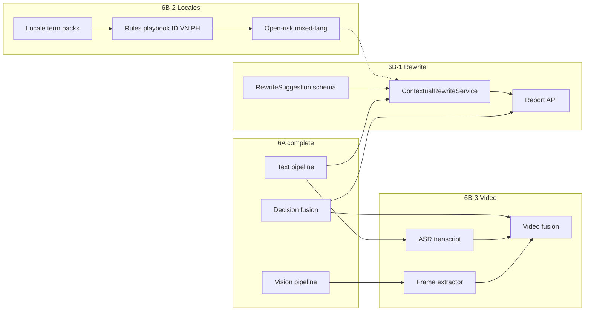

# Sprint 6B — Rewrite Intelligence, SEA Expansion, Video MVP

**Status:** Planned  
**Theme:** Contextual WARN rewrites · ID/VN/PH knowledge expansion · video → image + text fusion  
**Precedent:** Sprint 6A (vision branch live on `POST /demo/review`; taxonomy `skill-modules-1.2.0`)  
**ADR:** TBD — `ADR-006-contextual-rewrite` (6B-1), `ADR-007-sea-locale-expansion` (6B-2), `ADR-008-video-review-mvp` (6B-3)

---

## Constraints

| Constraint | Implication |
|------------|-------------|
| Unified review API | `POST /demo/review` remains single entry; video is a modality branch, not a new endpoint |
| Taxonomy SSoT | `docs/knowledge/skill-modules.json` → open-risk / vision prompts generated or synced from `risk_taxonomy` |
| Rewrite ≠ decision | Rewrite suggestions are advisory; `DecisionEngineService` verdict unchanged |
| 6B-2 scope | Rules + playbook + open-risk for **ID / VN / PH**; vision prompt inherits locale list |
| 6B-3 MVP | No full A/V sync analysis; frame sampling + ASR transcript only |
| Knowledge pack | Each stream bumps pack manifest (`demo-rule`, `demo-playbook`, rewrite corpus version) |

---

## Sprint goal

1. **Every WARN finding** returns at least one **copy-specific rewrite draft** (not static playbook `suggested_rewrite` alone).  
2. **Three new markets** (ID, VN, PH) have executable rules, playbook patterns, and open-risk mixed-language guidance.  
3. **Video upload** produces a fused verdict: visual findings from keyframes + text findings from transcript, merged in decision engine.

**Success:** Rewrite benchmark ≥ 80% human-acceptable on 20 WARN cases; ID/VN/PH smoke cases pass rule engine; 5 video fixtures reach correct REJECT/WARN via fusion.

---

## Work packages

### 6B-1 — Contextual WARN rewrite generation

**Priority:** P0 (highest user value post-6A)  
**Depends on:** `skill-modules-1.2.0` taxonomy, existing `rewrite-corpus`, `ReviewReportService`

| Task | Output |
|------|--------|
| 6B-1a — `RewriteSuggestion` schema | shared-kernel: `findingId`, `originalSpan`, `suggestedCopy`, `rationale`, `rewriteStrategy`, `confidence` |
| 6B-1b — Taxonomy → template router | Map `risk_type` / `rule_id` → `rewrite_template_id` from skill-modules + rewrite-corpus |
| 6B-1c — `ContextualRewriteService` | Input: `ReviewContext` + single WARN finding + evidence span; output: 1–3 rewrite variants |
| 6B-1d — `demo/rewrite.prompt.txt` v1 | LLM prompt: preserve product facts, qualify/remove claim, cite evidence gaps; JSON output |
| 6B-1e — Rewrite LLM gateway | `AAIRP_REWRITE_MODE=off\|stub\|live`; stub fixtures per `risk_type` |
| 6B-1f — Pipeline hook | After `runThroughReport`, batch rewrite for `decision.finalDecision === 'WARN'` findings only |
| 6B-1g — Report + API | `summary.findings[].rewrite_suggestions[]`; HTML section「修改建议」per finding |
| 6B-1h — Benchmark | `benchmark/rewrite-quality-v1.json` — 20 WARN cases with human-rated gold rewrites |

**Exit:** API returns contextual rewrite for each WARN finding in stub mode; report HTML shows before/after copy blocks.

**Out of scope 6B-1:** Auto-apply rewrites; BLOCKER/REJECT rewrite (delete-only guidance OK as static text).

---

### 6B-2 — Multi-language / market expansion (ID, VN, PH)

**Priority:** P1  
**Depends on:** 6B-1 taxonomy router (optional for rewrite templates); `rules.demo.json` pack structure

| Task | Output |
|------|--------|
| 6B-2a — Locale term packs | `demo/locales/id.json`, `vn.json`, `ph.json` — trigger terms per existing `risk_type` |
| 6B-2b — Rules pack extension | Add `countries: ["ID","VN","PH"]` scopes to APAC SA rules; country-specific market-claim rules (`demo-id-sa-market-claim`, etc.) |
| 6B-2c — Playbook extension | `playbook.demo.md` — `id-local-market-claim`, `vn-local-market-claim`, `ph-local-market-claim`; Bahasa / Vietnamese / Tagalog trigger keywords |
| 6B-2d — Open-risk mixed-language | Prompt section: accept mixed EN + local language; evidence spans must be verbatim from ad; no translation in findings |
| 6B-2e — skill-modules sync | `market-ranking-claim` + `localisation-error` pattern_ids for new locales; bump `modules_version` |
| 6B-2f — Dataset smoke cases | `demo/dataset/ID|VN|PH/` — 3 PASS + 3 REJECT/WARN per country |
| 6B-2g — Regression | Extend `benchmark-v3` tier `locale-expansion`; linkage validator covers new rule ↔ pattern links |

**Exit:** Rule engine fires on ID/VN/PH trigger terms; open-risk stub returns findings with local-language evidence spans.

**Out of scope 6B-2:** Full legal corpus per country; runtime machine translation of rules.

---

### 6B-3 — Video review MVP

**Priority:** P2 (after 6B-1 report shape stable; parallel with 6B-2a–c)  
**Depends on:** 6A vision pipeline, text pipeline, `DecisionEngineService.fuseFromFindings`

| Task | Output |
|------|--------|
| 6B-3a — `VideoAsset` ingest | Upload DTO: `content.videos[]`; validate URL / duration / size limits |
| 6B-3b — `VideoFrameExtractorService` | ffmpeg or sharp-based keyframe every N sec + scene-change heuristic; max 12 frames / video |
| 6B-3c — Frame → image branch | Each frame URL → existing `ImageSlicePlanner` + `VisionComplianceService` (1 slice / frame) |
| 6B-3d — `AudioTranscriptionService` | `AAIRP_ASR_MODE=stub\|live`; stub fixtures per video benchmark case |
| 6B-3e — Transcript → text branch | Append transcript to `normalizedContent.text` (or parallel `audioTranscript` field); rule + playbook + open-risk on combined text |
| 6B-3f — `VideoDiscoveryResult` | Aggregated `visionFindings` (dedupe by `risk_type` + timecode) + `transcriptFindings` |
| 6B-3g — Decision fusion | Extend `computeCombinedHasBlocker`: video vision BLOCKER ∪ text BLOCKER; `findingCounts.video` optional |
| 6B-3h — Benchmark | `benchmark/video-compliance-v1.json` — 6 cases: spoken medical claim, on-screen competitor logo, raw meat scene, clean control |
| 6B-3i — API unified | Same `POST /demo/review`; `content.videos` triggers branch; response metadata `modalities: ["text","image","video"]` |

**Exit:** Stub mode: 6/6 video benchmark cases correct decision; report shows frame thumbnails + transcript excerpt + fused verdict.

**Out of scope 6B-3:** Lip-sync / subtitle burn-in detection; real-time streaming; audio-only ads without keyframes.

---

## Dependency graph

| Package | Blocks | Blocked by |
|---------|--------|------------|
| 6B-1 | Report UX, legal pilot rewrite loop | — |
| 6B-2 | ID/VN/PH production reviews | — (6B-1 optional) |
| 6B-3 | Video modality | 6A vision stable; 6B-1 report fields recommended |

---

## Suggested timeline

| Week | Focus |
|------|-------|
| W1 | 6B-1a–e (schema + service + stub) |
| W2 | 6B-1f–h (pipeline + report + benchmark) |
| W3 | 6B-2a–e (locale rules + open-risk) |
| W4 | 6B-2f–g + 6B-3a–f (datasets + video extract + ASR) |
| W5 | 6B-3g–i (fusion + benchmark + pilot) |

---

## Risks & mitigations

| Risk | Mitigation |
|------|------------|
| Rewrite hallucinates product specs | Ground prompt on evidence spans only; forbid new numbers |
| ID/VN/PH term false positives | Start with high-precision triggers; benchmark before widen |
| Video cost (frames × vision) | Cap frames; skip vision on static talking-head segments |
| ASR errors on mixed language | Pass language hints; open-risk mixed-lang guardrails |
| Taxonomy drift | Generate open-risk WARN/REJECT lists from `skill-modules.json` in CI |

---

## Revision history

| Date | Change |
|------|--------|
| 2026-06-29 | Initial 6B plan — rewrite, SEA locales, video MVP |
